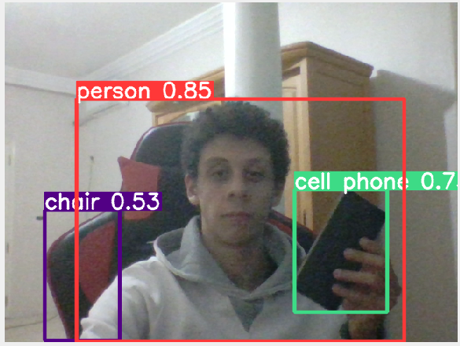

# YOLOv5 Demo
This repository contains the demonstration of the YOLOv5 [Ultralytics](https://ultralytics.com/) Objection Detection model.
The architecture that is being used by default is the pretrained **YOLOv5s** architecture.



## Usage
Installing requirements : 
```
pip install -r requirements.txt
```
Running the detection script :
```
./run.sh
```
Or directly running the following command :
```
python detect.py --weights yolov5s.pt--source /home/moez/Videos/Street_Footage.mp4
```
